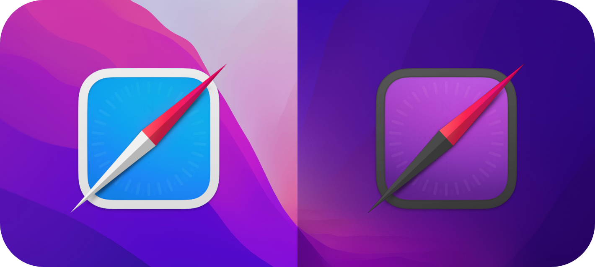

# Safari Icons for macOS Monterey



I felt like the Safari icons for Big Sur/Monterey had too much 'chrome', so I made new ones.

For both plain ol' Safari and [Safari Technology Preview](https://developer.apple.com/safari/technology-preview/) (in :new_moon_with_face: & :full_moon_with_face:)

## Light


## Dark


# Installation

**For Safari Technology Preview:** 

Since Safari Preview is user-installed, the icon can be replaced without any third-party apps.

1. Open Get Info on Safari Technology Preview (right click the application in Finder)
2. Drag and drop the .icns file over the current icon at the top-left corner
3. That's it! Don't worry, you can always return to the default app icon by selecting the current icon in the Info window and pressing delete.

**For Safari:**

Here is my unsolicited plug for [IconChamp](https://www.macenhance.com/iconchamp.html). This is the only app I've found that can change the icons for system-installed apps like Safari in Monterey. It's not free, but I think it's awesome.

The only free work-around that I've come up with is to create a simple AppleScript to open Safari:

```
tell application "Safari" to activate
```
and export it as an Application, which can take the new icon using the same instructions above for Preview (Get Info > drag & drop the icns).
